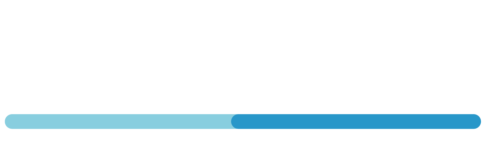

# TaskDev

Una herramienta de organización y planificación de proyectos de desarrollo de software.  
Tiene como objetivo crear espacios de trabajo para equipos de desarolladores.  

## Características:
- 2FA con Google Authenticator
- Chat
- Gestor de tareas
- Futura integración con Github
- Calendario
- Interfaz personalizable
  

## Tecnologías:
### Front:
- React
### Back:
- Node.js
- Express
- MySQL
### Herramientas:
- Figma
- Trello
- PostMan
